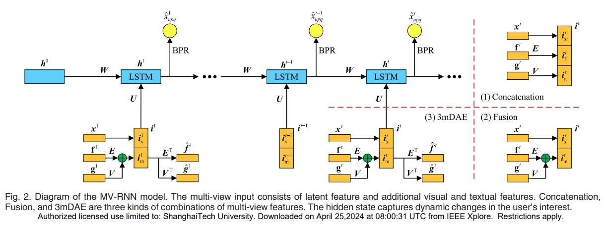

# MV-RNN



This is the code for the TKDE 2018 Paper: [MV-RNN: A Multi-View Recurrent Neural Network for Sequential Recommendation](https://ieeexplore.ieee.org/abstract/document/8534409).

## Usage

Our model is a little bit complicated and the annotations are in Chinese. If you would like to make a comparison, you can apply one of the variants of the model, called 'Con.' in this paper. It is easy to understand and implement.

## Requirements

- python
- Theano

## Citation

Please cite our paper if you use the code:
```
@article{cui2018mv,
  title={MV-RNN: A Multi-View Recurrent Neural Network for Sequential Recommendation},
  author={Cui, Qiang and Wu, Shu and Liu, Qiang and Zhong, Wen and Wang, Liang},
  journal={IEEE Transactions on Knowledge and Data Engineering},
  year={2018},
  publisher={IEEE}
}
```

## Contact information

If you have other questions or confusions, please send email to [cuiqiang1990@hotmail.com].
